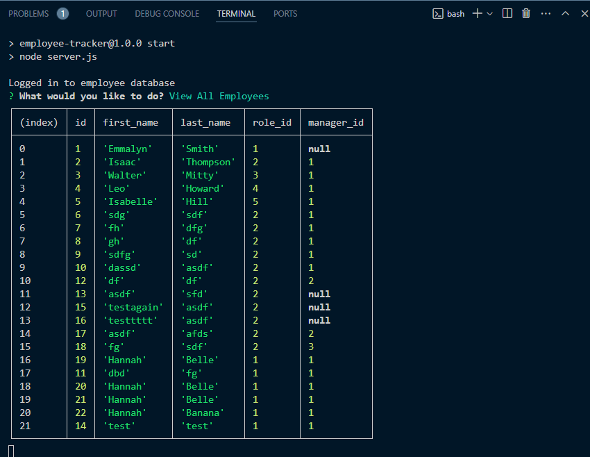

# SQL Employee Tracker

## Description

A content management system (CMS) to manage a company's employee database. This application is run from the command-line, and uses Node.js, Inquirer, and PostgreSQL.

## Installation

To run this application, in the terminal from, use command:

````
npm run start
````

## Usage

[This short video](https://drive.google.com/file/d/1wFxa6IHb4i9D5U8OFi9s_3AHeVkydLAL/view?usp=drive_link) demonstrates the application's functionality.

After running this application from the terminal, users are presented with several options:

- View All Employees
- Add Employees
- Update Employee Role
- View All Roles
- Add Role
- View All Departments
- Add Department
- Quit

The following screenshot shows these options:


Users should select an option, and answer the prompts that follow.

The following screenshot shows an example employee table:



The following screenshot shows an example Roles table:


The following screenshot shows an example Departments table:


## License

[MIT License](./LICENSE)